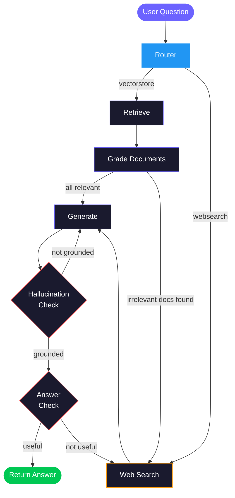

<div align="center">

# Nexus AI

### Self-Correcting Agentic RAG with LangGraph

An agentic RAG chatbot that **routes, retrieves, grades, generates, and self-corrects** in a stateful graph loop — with a full web UI, Supabase auth, and per-user conversation memory.

[](https://python.org)
[](https://fastapi.tiangolo.com)
[](https://langchain-ai.github.io/langgraph/)
[](https://supabase.com)
[](https://openai.com)

</div>

<br>

> Built on the [LangChain Cookbook](https://github.com/mistralai/cookbook/tree/main/third_party/langchain) by [Sophia Young](https://x.com/sophiamyang) (Mistral) and [Lance Martin](https://x.com/RLanceMartin) (LangChain) — then extended with a web UI, auth layer, persistent memory, and a production-oriented package architecture.

<br>

## Highlights

| | Feature | What it does |
|:--:|---|---|
| :compass: | **Adaptive Routing** | An LLM-powered router classifies each question and directs it to the vector store *or* live web search |
| :mag: | **Self-RAG** | Retrieved documents are graded for relevance — irrelevant docs trigger an automatic web search fallback |
| :repeat: | **Reflective RAG** | Generated answers are checked for hallucinations *and* usefulness; the graph loops back to retry or re-search |
| :lock: | **Auth & Memory** | Supabase email/password auth with per-user conversation threads persisted via a Postgres checkpointer |
| :art: | **Web UI** | Dark-themed responsive frontend with sign-in/sign-up and a chat interface with thread sidebar |
| :zap: | **Response Streaming** | Real-time token streaming via Server-Sent Events — answers appear word-by-word |
| :brain: | **Semantic Caching** | Redis-backed embedding cache with cosine similarity — repeated questions return instantly |
| :moneybag: | **Model Tiering** | Grader chains use `gpt-4o-mini` for cost efficiency; generation uses the full model |
| :test_tube: | **Tested Chains** | Integration tests for every LLM chain — retrieval grader, generation, hallucination grader, answer grader, router |

<br>

## Architecture



Each box is a **LangGraph node**. Conditional edges implement the self-correcting loop — the graph retries generation or falls back to web search until it produces a grounded, useful answer.

<br>

## Tech Stack

| Layer | Technology | Role |
|:--|:--|:--|
| **Orchestration** | [LangGraph](https://langchain-ai.github.io/langgraph/) | Stateful graph with conditional routing and cycles |
| **LLM** | [OpenAI](https://openai.com) via LangChain | Chat completions for all chains (structured output) |
| **Vector Store** | [ChromaDB](https://www.trychroma.com/) | Local persistent embedding store — zero infrastructure |
| **Web Search** | [Tavily](https://tavily.com) | LLM-optimized web search fallback |
| **Auth & DB** | [Supabase](https://supabase.com) | Email/password auth + Postgres conversation memory |
| **Cache** | [Redis](https://redis.io) via [Upstash](https://upstash.com) | Semantic caching with embedding similarity *(optional)* |
| **API** | [FastAPI](https://fastapi.tiangolo.com) | REST endpoints with SSE streaming |
| **Observability** | [LangSmith](https://smith.langchain.com/) | Tracing and debugging *(optional)* |

<br>

## Quick Start

### Prerequisites

- Python 3.12+
- A [Supabase](https://supabase.com) project (free tier works)
- API keys: [OpenAI](https://platform.openai.com/api-keys), [Tavily](https://tavily.com)
- *(Optional)* A Redis instance for semantic caching — [Upstash](https://upstash.com) free tier or local Docker

### 1. Clone & install

```bash
git clone <repo-url>
cd AgenticRag

python -m venv .venv
source .venv/bin/activate   # Windows: .venv\Scripts\activate

pip install -r requirements.txt
```

### 2. Configure environment

```bash
cp .env.example .env
# Fill in your actual keys — see table below
```

<details>
<summary><b>Environment variables reference</b></summary>
<br>

| Variable | Required | Purpose |
|:--|:--:|:--|
| `OPENAI_API_KEY` | Yes | OpenAI API — powers all LLM chains |
| `TAVILY_API_KEY` | Yes | Web search fallback for out-of-domain questions |
| `SUPABASE_URL` | Yes | Supabase project URL |
| `SUPABASE_ANON_KEY` | Yes | Public key for client-side auth |
| `SUPABASE_SERVICE_ROLE_KEY` | Yes | Admin key for thread management |
| `SUPABASE_DB_URL` | Yes | Direct Postgres connection for LangGraph checkpointer |
| `REDIS_URL` | No | Redis connection URL for semantic caching (e.g. `rediss://...` for Upstash) |
| `GRADER_MODEL` | No | Model for grader chains (default: `gpt-4o-mini`) |
| `LANGCHAIN_API_KEY` | No | LangSmith tracing (if `LANGCHAIN_TRACING_V2=true`) |
| `LANGCHAIN_TRACING_V2` | No | Enable LangSmith tracing (`true` / `false`) |
| `LANGCHAIN_PROJECT` | No | LangSmith project name |

</details>

### 3. Run the Supabase migration

Open **Supabase Dashboard > SQL Editor > New query** and paste the contents of [`migrations/001_create_threads.sql`](migrations/001_create_threads.sql). This creates the `threads` table with Row Level Security policies.

### 4. Ingest documents

Run once — loads three [Lilian Weng](https://lilianweng.github.io/) blog posts, chunks them, and persists embeddings to `.chroma_db/`:

```bash
python -m app.ingestion
```

### 5. Start the server

```bash
uvicorn app.server:app --reload
```

| URL | What you get |
|:--|:--|
| [`http://127.0.0.1:8000`](http://127.0.0.1:8000) | Sign In / Sign Up page |
| [`http://127.0.0.1:8000/app`](http://127.0.0.1:8000/app) | Chat interface *(requires auth)* |
| [`http://127.0.0.1:8000/docs`](http://127.0.0.1:8000/docs) | Interactive Swagger API docs |

### 6. Run tests

```bash
python -m pytest tests/ -v
```

### 7. CLI mode *(no auth, local dev)*

```bash
python -m app.cli
```

<br>

## API Reference

All `/chat` and `/threads` endpoints require a Supabase JWT:
```
Authorization: Bearer <access_token>
```

| Endpoint | Method | Auth | Description |
|:--|:--:|:--:|:--|
| `/` | `GET` | — | Sign In / Sign Up page |
| `/app` | `GET` | — | Chat page *(JS redirects if no token)* |
| `/auth/signup` | `POST` | — | Create account `{ "email", "password" }` |
| `/auth/login` | `POST` | — | Login → access + refresh tokens |
| `/chat` | `POST` | :lock: | `{ "question", "thread_id?" }` — streams response via SSE; cache hits return JSON |
| `/threads` | `GET` | :lock: | List the authenticated user's conversation threads |
| `/threads/{id}/messages` | `GET` | :lock: | Load past messages for a thread |

<br>

## Project Structure

```
AgenticRag/
├── pyproject.toml                       # Project metadata, tool config
├── requirements.txt                     # Pinned dependencies
├── .env.example                         # Environment variable template
│
├── CLAUDE.md                            # Claude Code project guidelines
├── app/                                 # Main Python package
│   ├── config.py                        # Pydantic-settings centralized config
│   ├── server.py                        # FastAPI app assembly + async lifespan
│   ├── cache.py                         # Redis-backed semantic cache
│   ├── cli.py                           # CLI entry point (no auth)
│   ├── ingestion.py                     # Document loading + ChromaDB indexing
│   │
│   ├── api/                             # Route modules (one file per concern)
│   │   ├── deps.py                      #   Supabase clients, auth dependency
│   │   ├── auth.py                      #   /auth/signup, /auth/login
│   │   ├── chat.py                      #   /chat
│   │   ├── threads.py                   #   /threads
│   │   └── pages.py                     #   Static HTML serving
│   │
│   └── graph/                           # LangGraph agent
│       ├── graph.py                     #   Workflow: nodes, edges, routing
│       ├── state.py                     #   GraphState TypedDict
│       ├── consts.py                    #   Node name constants
│       ├── chains/                      #   LCEL chain definitions
│       │   ├── router.py               #     Question → vectorstore / websearch
│       │   ├── retrieval_grader.py      #     Document relevance scoring
│       │   ├── generation.py            #     RAG answer generation
│       │   ├── hallucination_grader.py  #     Hallucination detection
│       │   └── answer_grader.py         #     Answer usefulness scoring
│       └── nodes/                       #   Graph node functions
│           ├── retrieve.py              #     Query ChromaDB
│           ├── grade_documents.py       #     Filter irrelevant docs
│           ├── generate.py              #     Produce answer + messages
│           └── web_search.py            #     Tavily fallback
│
├── tests/
│   ├── conftest.py                      # Shared fixtures (env loading)
│   └── test_chains.py                   # Integration tests for all chains
│
├── frontend/                            # Static frontend (served by FastAPI)
│   ├── index.html                       # Auth page
│   ├── chat.html                        # Chat interface + thread sidebar
│   ├── css/styles.css                   # Dark theme, glassmorphism
│   ├── js/auth.js                       # Auth logic, token storage
│   ├── js/chat.js                       # Chat API, message rendering
│   └── assets/nexus-logo.svg            # App logo
│
└── migrations/
    └── 001_create_threads.sql           # threads table + RLS policies
```

<br>

## Graph Flow — Decision Table

Every conditional edge in the graph maps to a focused LLM grader chain:

| Decision Point | Condition | Next Node | Grader Chain |
|:--|:--|:--|:--|
| **Router** | Question about agents / prompts / LLMs | `retrieve` | `chains/router.py` |
| **Router** | Any other question | `websearch` | `chains/router.py` |
| **Grade Documents** | All docs relevant | `generate` | `chains/retrieval_grader.py` |
| **Grade Documents** | Any doc irrelevant | `websearch` | `chains/retrieval_grader.py` |
| **Hallucination Check** | Generation grounded in docs | Answer Check | `chains/hallucination_grader.py` |
| **Hallucination Check** | Not grounded | `generate` *(retry)* | `chains/hallucination_grader.py` |
| **Answer Check** | Answer resolves question | Return to user | `chains/answer_grader.py` |
| **Answer Check** | Doesn't resolve | `websearch` | `chains/answer_grader.py` |

<br>

---

<br>

## Design Decisions & Architecture Rationale

> This section explains the **why** behind each major technical choice.

<br>

### Why LangGraph instead of a simple LangChain chain?

A basic RAG pipeline is linear: retrieve → generate → return. If the retrieved documents are irrelevant or the answer hallucinates, the user simply gets a bad response.

LangGraph models the pipeline as a **stateful directed graph with conditional edges and cycles**. This enables a self-correcting loop:

```
retrieve → grade → (irrelevant?) → web search → generate → (hallucinated?) → retry
```

The graph can **route** questions to different retrieval strategies, **loop back** when documents fail relevance checks, **retry** generation when hallucination is detected, and **re-search** when the answer doesn't address the question. This dramatically improves answer quality compared to single-pass RAG.

<br>

### Why separate grader chains instead of one big prompt?

Each grader (retrieval relevance, hallucination, answer usefulness) is a small, focused LCEL chain with **structured output** — a Pydantic model returning `"yes"` / `"no"` via function calling.

| Benefit | How |
|:--|:--|
| **Testable** | Each chain is independently tested in `tests/test_chains.py` |
| **Composable** | Chains can be swapped or tuned without touching graph logic |
| **Reliable** | Structured output ensures consistent binary responses — no free-text parsing |
| **Observable** | Each chain appears as a separate step in LangSmith traces |

<br>

### Why Supabase for auth + memory?

The project needed both authentication and persistent conversation memory. Supabase provides all of this from a single platform:

- **Auth** — Built-in email/password with JWT tokens; no custom auth implementation needed
- **Postgres** — LangGraph's `PostgresSaver` checkpointer stores full conversation state (including intermediate graph state), enabling seamless conversation resumption
- **Row Level Security** — Thread data is scoped to individual users at the database level
- **Single provider** — Auth, database, and RLS in one service instead of stitching multiple providers

<br>

### Why the `app/` package structure?

The original codebase had all entry points at the project root with no proper Python package. The server mixed auth, chat, threads, page serving, and DB init in a single 168-line file.

| Problem (before) | Solution (after) |
|:--|:--|
| Monolithic `server.py` with 5 concerns | Focused route modules: `api/auth.py`, `api/chat.py`, `api/threads.py`, `api/pages.py`, `api/deps.py` |
| `os.environ` and `load_dotenv()` scattered everywhere | Centralized `app/config.py` with Pydantic Settings — validates all env vars at startup |
| `from graph.chains.X` imports with no package root | Clean `from app.graph.chains.X` — explicit, no ambiguity |
| `app = build_graph()` at module level (side effect on import) | `build_graph()` called explicitly in server lifespan or CLI |
| Tests buried in `graph/chains/tests/` | Top-level `tests/` with `conftest.py`, following pytest conventions |

<br>

### Why `pydantic-settings` for configuration?

Instead of `os.environ.get()` scattered across files:

- **Fail-fast validation** — Missing keys cause a clear startup error, not a mid-request crash
- **Type coercion** — Booleans, strings, and URLs are automatically parsed from `.env`
- **Single source of truth** — One `Settings` class documents every config value the app needs
- **Cached singleton** — `@lru_cache` on `get_settings()` reads the `.env` file exactly once

<br>

### Why ChromaDB?

ChromaDB provides **zero-infrastructure local development**. Embeddings persist to a local `.chroma_db/` directory — no cloud vector DB account required. Anyone cloning the repo can run the full pipeline after `python -m app.ingestion`. For production, the retriever in `app/ingestion.py` can be swapped to a managed store (Pinecone, Weaviate, pgvector) with minimal changes.

<br>

### Why Tavily for web search?

Tavily is purpose-built for LLM applications — it returns clean, parsed content (not raw HTML) optimized for context windows. It plugs directly into LangChain as a tool, making it a drop-in node in the graph. The web search fallback ensures the chatbot answers questions outside its vector store's domain instead of returning *"I don't know."*

<br>

### Why model tiering?

Grader chains (router, retrieval grader, hallucination grader, answer grader) perform binary classification — a task that doesn't require the most capable model. Using `gpt-4o-mini` for graders cuts per-query cost significantly while the generation chain retains the full model for answer quality. The `GRADER_MODEL` setting makes this configurable without code changes.

<br>

### Why semantic caching with Redis?

Identical or near-identical questions hitting the full RAG pipeline waste tokens and add latency. The semantic cache embeds each question with OpenAI, stores the embedding + response in Redis, and on subsequent queries computes cosine similarity against all cached entries. A 0.95 threshold ensures only truly equivalent questions return cached answers. Redis was chosen for its speed and broad hosting options (Upstash free tier, Docker, or any managed Redis). The cache is fully optional — when `REDIS_URL` is empty, the system operates without it.

<br>

### Why SSE streaming?

Without streaming, users stare at a loading spinner for 5–15 seconds while the full RAG pipeline runs. Server-Sent Events let the frontend render tokens as they arrive from the generation model, giving immediate visual feedback. The implementation uses LangGraph's `astream_events` to capture only generation tokens (not grader outputs), yielding `data: {"token": "..."}` per chunk and a final `data: {"done": true}` event with the complete answer and thread ID.
